# QR Studio

A client-side QR code generator and designer built with React, TypeScript, Vite, and Tailwind CSS.

Create QR codes, customize their appearance, and export them directly from your browser. No backend is required.

## Features

* **Multiple QR types** — Create QR codes for URLs, text, email, phone numbers, and Wi-Fi networks.
* **QR customization** — Change colors, backgrounds, gradients, margins, and other styling options.
* **Logo support** — Add a custom image to the center of the QR code.
* **QR readability checks** — Check contrast, margins, and other settings that can affect scanning.
* **Export options** — Download QR codes as PNG, JPG, or SVG, or copy them to the clipboard.
* **Local history** — Recently created QR codes are saved locally in the browser.
* **Theme support** — Light, dark, and system themes.
* **Client-side processing** — QR data and uploaded images are processed locally in the browser.

## Screenshots

### Main Interface

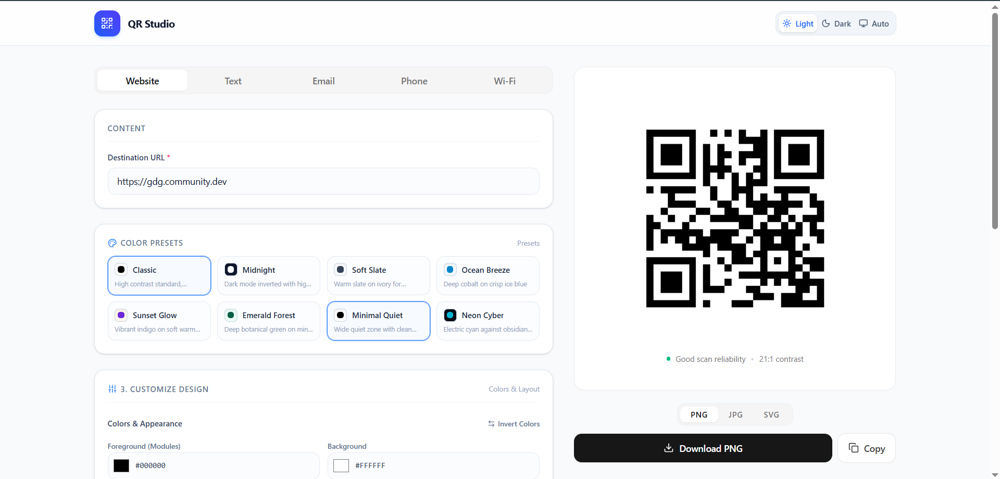
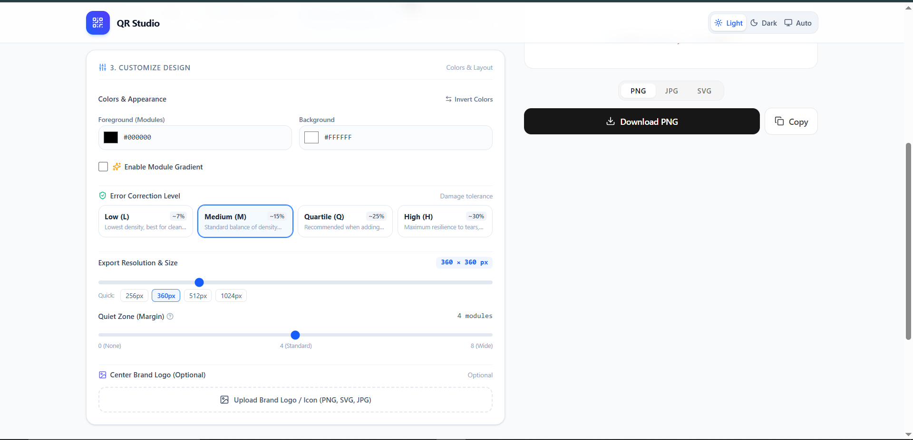
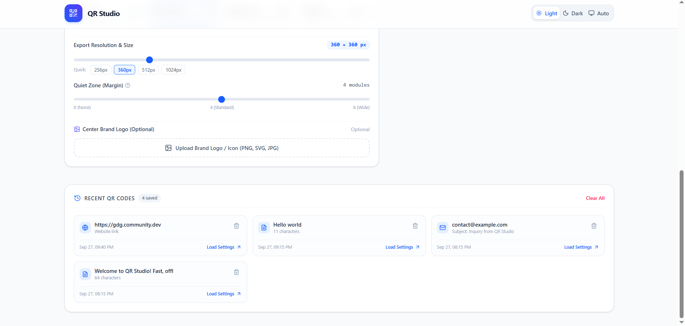
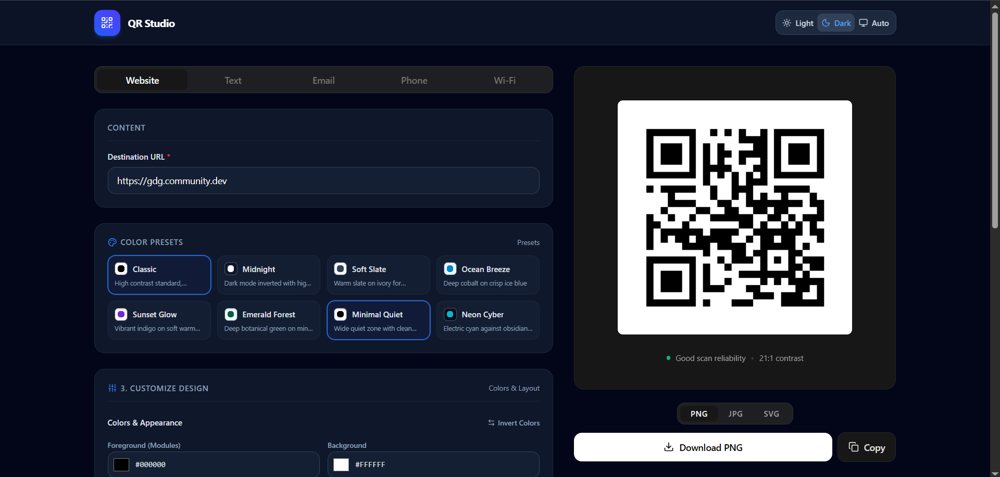

### QR Customization

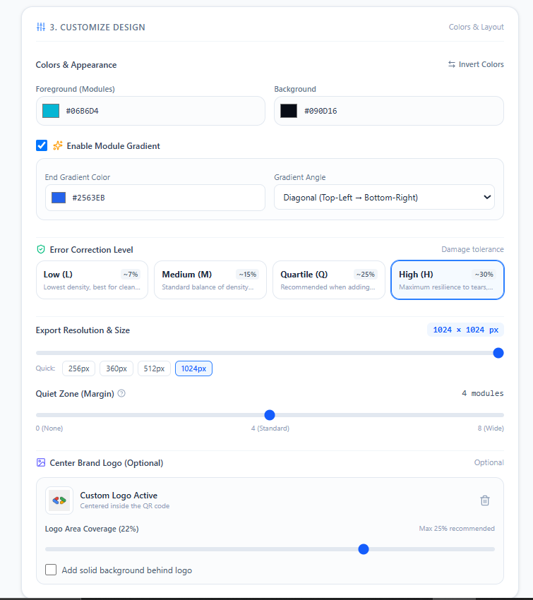
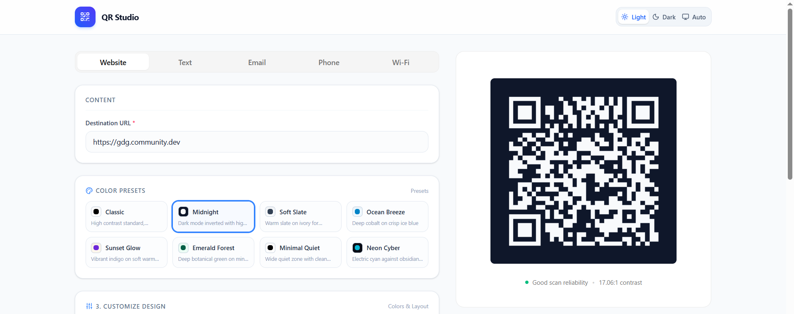
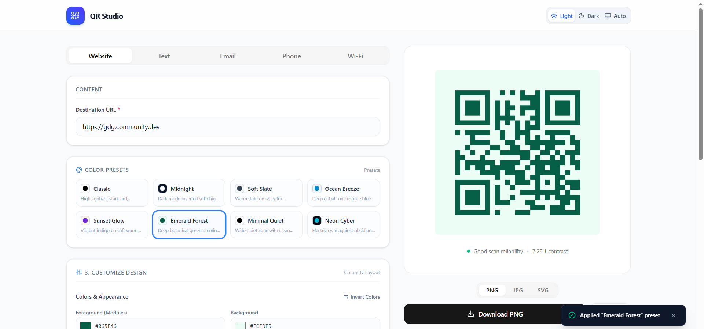
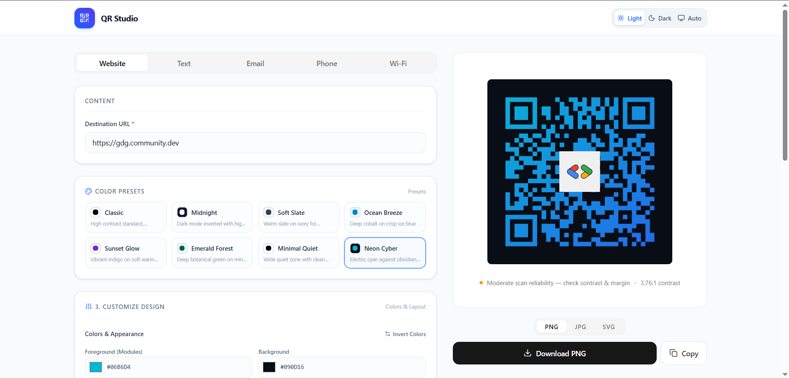

### types of QR Code

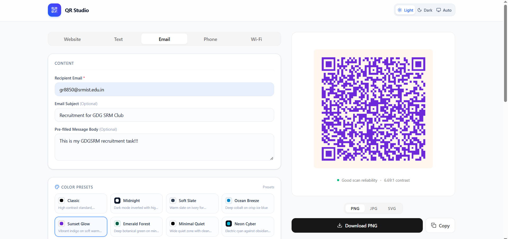
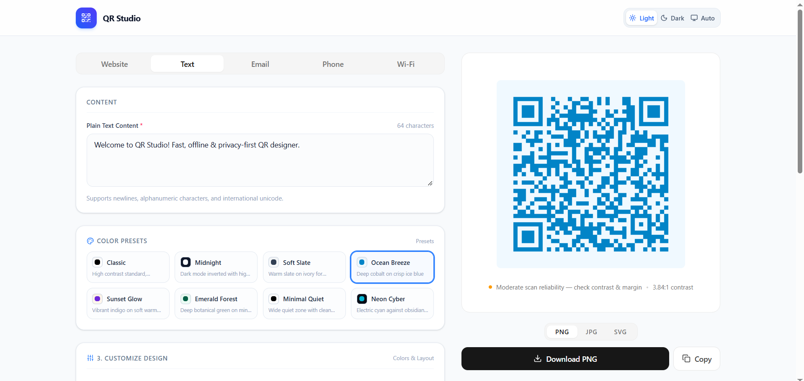
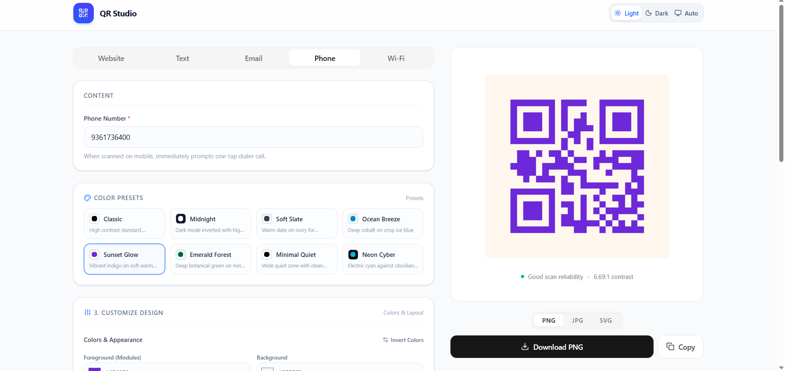
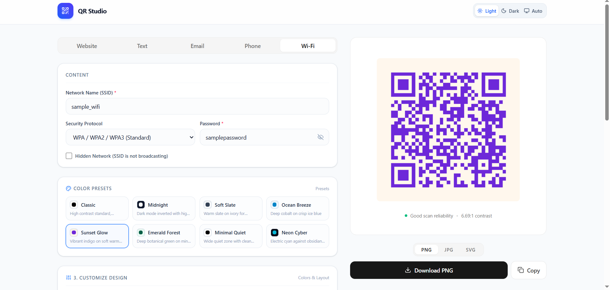

## Getting Started

### Requirements

* Node.js 18 or newer
* npm

### Installation

```bash
git clone <repository-url>
cd GDGSRM_QR
npm install
```

### Run the project

```bash
npm run dev
```

The development server will start at the local URL shown in the terminal.

## Available Scripts

| Command           | Description                   |
| ----------------- | ----------------------------- |
| `npm run dev`     | Starts the development server |
| `npm run build`   | Creates a production build    |
| `npm run preview` | Previews the production build |
| `npm run test`    | Runs the test suite           |
| `npm run lint`    | Runs Oxlint                   |

## Tech Stack

* React 19
* TypeScript
* Vite
* Tailwind CSS
* Lucide React
* `qrcode`
* Vitest
* Testing Library
